# Intelligence Cubed (i³) – Aleo

<div align="center">


**The AI Model Nasdaq**

Where AI models are both **Model-as-a-Service (MaaS)** and **liquid, revenue-sharing assets**. Discover, compare, and compose models in a visual Canvas with transparent **ALEO** and **on-chain x402-style payments** on **Aleo**.

[](https://opensource.org/licenses/MIT)
[](https://nodejs.org/)
[](https://testnet.explorer.provable.com)
[](https://testnet.explorer.provable.com)
[](https://testnet.explorer.provable.com)

[Twitter](https://x.com/I3_Cubed) | [Telegram](https://t.me/I3_Cubed)

</div>

---

## 📚 Table of Contents
1. [Overview](#1-overview)
2. [What the Product *Is*](#2-what-the-product-is)
3. [Problem & Solution](#3-problem--solution)
4. [Core Concepts](#4-core-concepts)
5. [Key Features](#3-key-features)
   - [Multi-Page AI Hub](#multi-page-ai-hub)
   - [x402-Style & On-chain Payments](#x402-style--on-chain-payments)
6. [How We Implement Privacy](#how-we-implement-privacy)
7. [How x402-Style & Aleo Payments Work](#4-how-x402-style--aleo-payments-work)
   - [A) Single-Model Chat Flow](#a-single-model-chat-flow)
   - [B) Modelverse / Benchmark "Try" Flow](#b-modelverse--benchmark-try-flow)
   - [C) Workflow & Canvas Flow](#c-workflow--canvas-flow)
   - [D) Prepaid API Calls](#d-prepaid-api-calls-token-purchase)
   - [E) Share Purchase](#e-share-model-ownership-purchase)
8. [User Journey](#5-user-journey)
   - [Core User Flows](#core-user-flows-x402-payment-first-approach)
   - [Detailed User Journey](#detailed-user-journey-with-x402-payments)
9. [Architecture & Tech Stack](#6-architecture--tech-stack)
   - [High-Level System Architecture](#high-level-system-architecture)
   - [Component Architecture](#component-architecture)
   - [Data Flow Architecture](#data-flow-architecture-with-x402-payments)
   - [Architecture Components](#architecture-components)
10. [Technology Stack](#7-technology-stack)
11. [Getting Started](#8-getting-started)
    - [Prerequisites](#prerequisites)
    - [Aleo Configuration](#aleo-configuration)
    - [Clone & Install](#clone--install)
    - [Environment Variables](#environment-variables)
12. [Local Development](#9-local-development)
    - [Frontend (Vite dev server)](#frontend-vite-dev-server)
    - [Backend / MCP server](#backend--mcp-server)
    - [Production Build](#production-build)
13. [License](#-license)

---

# Intelligence Cubed (i³)

> The **Nasdaq for AI models** — a decentralized **Modelverse** where models are both **Model-as-a-Service (MaaS)** and **liquid, revenue-sharing assets**. Discover, compare, and compose models in a visual Canvas; pay per call with transparent ALEO pricing; and get verifiable on-chain receipts via **x402-style** payments on **Aleo**.

---

## 1) Overview

**Intelligence Cubed (i³)** is the **Nasdaq for AI models** — a decentralized modelverse that lets users:

- Discover curated AI models with transparent **ALEO** (Aleo Credits) pricing  
- Benchmark and compare models with community-driven **Proof of Intelligence**  
- Build and run multi-step workflows in a **Canvas** editor  
- Chat with any model or workflow via a unified **Chats** interface

Every paid action (single model call or workflow run) is **gated by x402-style invoices** and settled in **ALEO on Aleo** via **Leo Wallet**. Only **after** on-chain payment confirmation does the app invoke the underlying model(s) and stream back the answer. We **prefer private transfers** (`transfer_private`) on Aleo to strengthen on-chain privacy where possible.

---

## 2) What the Product *Is*

i³ is four layers that work together:

1. **Model-as-a-Service (MaaS)**  
   Call models directly via chat/API, chain them into workflows, and enable fine-tuning and secondary creation.

2. **Model as a Liquid Asset**  
   Tokenize models through **IMO (Initial Model Offering)** so ownership and usage revenues are shared transparently.

3. **Co-Creation (Canvas)**  
   Drag-and-drop to compose multi-step pipelines; derivative models automatically return royalties to ancestors.

4. **Democratic Benchmark (Proof of Intelligence)**  
   Usage-driven rankings and indices so the best models rise on merit, not just lab tests.

> **Open-source threshold:** when **>51%** of a model's ownership is publicly held, the model transitions to open source to accelerate adoption and remixing.

---

## 3) Problem & Solution

### Problems
- **Model discovery gap:** Lists are long, quality varies, pricing is opaque, and router logic is often a black box.  
- **Payment gap:** Most AI apps are centralized, credit- or subscription-based. There's no standard way for third-party agents to **programmatically** pay per call and obtain **verifiable on-chain receipts**.  
- **Privacy gap:** Traditional payment rails and many chains expose payer identity, amounts, and patterns to observers.

### Our Solution
- **Modelverse + Benchmark + Workflows + Canvas** for one-stop **discover → compare → compose**.  
- **Tokenized ownership & royalties** (IMO + derivative revenue share) for sustainable creator incentives.  
- **Unified x402-style payment layer**: each call is invoiced, paid on Aleo (with **private-first** options), verified on-chain, then executed.  
- **Privacy-by-design**: private transfers, anonymous tokens, minimal logging, and opaque invoice memos to reduce correlation and leakage.

---

## 4) Core Concepts

- **IMO (Initial Model Offering):** Creators mint model ownership, fund development, and share future usage revenues.  
- **Royalties Accumulation:** Derivative models automatically pay upstream royalties across the lineage.  
- **Proof of Intelligence:** Continuous, usage-driven scoring and vertical indices (quality, usage, momentum).  
- **Democratic Pricing:** Stablecoin-anchored pricing that reflects demand and capacity, not arbitrary fees.

---

## 3️⃣ Key Features

### Multi-Page AI Hub

* **Chats (`index.html`)**  
  Single-model or Auto Router chat interface with a central input box:

  * "Ask AI anything…" prompt
  * **Auto Router** toggle: when enabled, the system scores hundreds of models and picks the best suited one for the user's query.

* **Modelverse (`modelverse.html`)**  
  Model marketplace with:

  * Name, category, industry
  * **Price / API call (ALEO)**
  * Usage, compatibility, total score
  * Actions: **Try** (jump into Chats) & **Add to Cart**

* **Benchmark (`benchmark.html`)**  
  Model benchmark leaderboard showing:

  * Performance scores
  * Usage metrics
  * Price & market stats
  * One-click "Try" into Chats.

* **Workflows (`workflow.html`)**  
  Workflow leaderboard:

  * Each card shows **Compute Cost**, **Estimated Gas**, and **Total (x402)** in ALEO.
  * Actions: **Details**, **Pay with x402**.
  * **Two payment modes**: Prepay once (single tx for all nodes) or Pay per node.

* **Canvas (`canvas.html`)**  
  Visual workflow editor:

  * Drag-and-drop nodes (models)
  * Connect them into multi-step pipelines
  * Click **Run** to execute — choose **Prepay once** or **Pay per node**.

* **MyCart (`mycart.html`)**  
  Shopping cart for bulk purchases:

  * Add models from Modelverse to cart.
  * Purchase **API call tokens** (prepaid credits) and **ownership shares**.
  * Batch checkout with x402-style payment.

### x402-Style & On-chain Payments

* **402 Payment Progress widget** in the bottom-right shows:

  * Invoice status (Pending → Paid / Cancelled)
  * Amount, memo, and Aleo tx / explorer link.
* **Leo Wallet** integration:

  * Users connect Leo Wallet and confirm each payment (prefer **private** transfers when possible).
  * Every payment is verifiable on **Aleo Explorer** (e.g. Provable Explorer).
* **Prepaid Credits**: Pre-purchase API calls; use them later without additional payments.
* **Daily Check-in**: Claim daily ALEO rewards to offset usage costs.

---

## How We Implement Privacy

We implement privacy across **on-chain**, **server-side**, and **client-side** layers so that pay-to-use AI stays usable while reducing exposure of identity, amounts, and behavior.

### 1) On-Chain Privacy: Private-First Payments

In **`aleo-payment.js`**, payments **prefer** `credits.aleo/transfer_private`. If the user has no private records or insufficient private balance, the UI guides them to run **`transfer_public_to_private`** (convert public balance into private records) and then retry a private payment. If the user declines or conversion fails, the flow falls back to **`transfer_public`**.

- **Benefit:** For public chain observers, private transfers significantly reduce what can be inferred (transaction patterns, balance habits, linkage between addresses and usage). Amounts and counterparties are not visible on the public chain for private transfers.

### 2) Correlation Reduction: Opaque Invoice Memo

In **`server/mcp/payments.js`** we intentionally **do not** put the invoice `request_id` in the on-chain payment **memo**. Instead we generate an **unlinkable short random memo** (`createOpaqueMemo()`).

- **Goal:** Reduce correlation between a specific app request (and any client/server logs) and a specific invoice identifier visible in wallet UIs or explorer metadata. This makes it harder to link a given payment to a particular chat or workflow run.

### 3) Data Minimization on Disk (Default)

**`server/mcp/store.js`** defaults to **redacted persistence** (unless explicitly enabled with `MCP_STORE_SENSITIVE=1` for debugging):

- Does **not** persist **prompt** (content-sensitive)
- Does **not** persist **wallet_address** (identity-sensitive)
- Stores only minimal **result** stats (status/usage/error/warning), not the full model output
- Stores only minimal **verification** (e.g. ok/code/network), excluding linkable explorer URLs

This reduces privacy risk in scenarios such as billing file leaks, ops mis-share, or log archives.

### 4) Privacy-Safe Logging

- **Server:** **`server/mcp/log.js`** provides `redactPaymentHeader`, `redactTx`, `redactUrl` and is gated by `MCP_DEBUG`. Sensitive headers and transaction IDs are redacted unless debug is explicitly enabled.
- **Client:** **`aleo-payment.js`** masks addresses, avoids printing private record inputs, and buckets amounts in logs (e.g. magnitude ranges like `1e5-1e6` instead of exact microcredits). Detailed debug output is off by default and can be enabled via `ALEO_PAYMENT_DEBUG` or localhost.

### 5) Anonymous Deposit + Anonymous Invoke (Privacy-First Path)

In addition to per-call “402 invoice + payment proof”, we support a **privacy-first alternative**: **deposit once (preferably with `transfer_private`) → receive an anonymous access token → invoke APIs using only the token**.

- **No wallet address at invoke time:** The server checks only **`X-Anonymous-Token`**; the client does not send its wallet address for each call.
- **Decouple payer from caller:** Reduces linkage between on-chain payment identity and off-chain API requests (network-layer correlation may still apply; see limitations below).

**Flow:**

1. User pays the platform recipient via Leo Wallet (preferably **`transfer_private`**).
2. Client sends **`tx_id` + `amount`** to **`/mcp/deposit`**.
3. Server returns a random **`access_token`** and credits the balance.
4. Subsequent calls use **`/mcp/anonymous/invoke`** with **`X-Anonymous-Token: <token>`**; the server deducts token balance and invokes the model **without persisting a wallet address**.

**Token storage:**

- Server stores tokens in **`data/anonymous-tokens.json`** using **`sha256(token)`** as the key (with legacy raw-key migration), reducing blast radius if the file is exposed.
- Client stores the token in **sessionStorage** by default (lower persistence risk) and can migrate from legacy **localStorage**.

### 6) Retention & Cleanup

- **Billing entries:** Only the last **30** days of terminal-state records are kept by default (`MCP_BILLING_RETENTION_DAYS=30`); in-flight entries are not affected.
- **Anonymous token events:** Deposit/usage events are retained for **30** days by default (`MCP_TOKEN_EVENT_RETENTION_DAYS=30`); balances are unaffected.

### 7) Privacy Boundaries & Limitations

- **Network-layer observability:** The server can still observe IP, User-Agent, and timing. Anonymous tokens remove direct wallet linkage but do not eliminate network-level correlation.
- **Verification strength:** Some endpoints may relax synchronous on-chain verification for UX or when Leo Wallet returns local IDs. You can enforce asynchronous verification via **`server/mcp/aleo-verifier.js`** (delayed access, risk-based sampling).
- **Deposit anti-forgery:** For anonymous token balances to be strongly trustworthy, **`/mcp/deposit`** should enforce on-chain verification and idempotency (each `tx_id` credited at most once).

---

## 4️⃣ How x402-Style & Aleo Payments Work

### A. Single-Model Chat Flow

1. User opens **Chats** (`index.html`), selects a model (or enables Auto Router), and sends a question, e.g. `"What does this do?"`.
2. The frontend sends the request to the MCP server; the server:

   * Calculates the model price in ALEO.
   * Creates a **x402-style payment** (HTTP 402) describing the required payment.
3. The UI shows a **402 Payment Progress** card and prompts the user to **connect Leo Wallet**.
4. Leo Wallet is used to send ALEO:

   * User approves a **transfer_private** (or, if needed, **transfer_public_to_private** then **transfer_private**; or **transfer_public** as fallback).
5. Once the transaction is confirmed:

   * The 402 card shows **Paid – Payment settled on Aleo**, including:

     * Amount (ALEO)
     * Memo (opaque; not the request_id)
     * Explorer link to **Aleo Explorer** (where applicable).
6. Only then does the MCP server forward the prompt to the selected model and stream the answer back into the chat.

### B. Modelverse / Benchmark "Try" Flow

1. User visits **Modelverse** or **Benchmark** and clicks **Try** next to a model.
2. They are redirected to **Chats** with that model pre-selected.
3. They ask a question; the **same x402-style flow** (invoice → Leo Wallet → Aleo → answer) runs automatically.

### C. Workflow & Canvas Flow

Users can run multi-model workflows with **two payment options**:

#### Option 1: Prepay Once (Recommended)
Pay a single transaction upfront for all nodes in the workflow.

1. User opens **Workflows** and clicks **Pay with x402** on a workflow card.
2. A dialog appears: **"Prepay once"** vs. **"Pay per node"** — user selects **Prepay once**.
3. The app requests a **single x402-style invoice** covering all nodes:
   * Backend calculates total cost = Σ (compute cost + gas) for all nodes.
   * Returns a 402 with a detailed **cost breakdown** per node.
4. User pays once via Leo Wallet (single transaction; private when possible).
5. After payment verification, the user receives a **workflow_session_id**.
6. The app opens **Canvas** (or redirects to **Chats**); all nodes execute **without additional payments**.

#### Option 2: Pay Per Node
Pay for each node separately as it executes.

1. User selects **Pay per node** in the dialog.
2. The app opens **Canvas**, pre-loading the workflow graph.
3. User clicks **Run**; backend returns a 402 for the **first node only**.
4. User pays via Leo Wallet; node executes.
5. Backend returns a 402 for the **next node**; repeat until all nodes complete.
6. Final results surface back through the **Chats** interface.

| Mode | Transactions | Use Case |
|------|--------------|----------|
| **Prepay Once** | 1 | Run entire workflow seamlessly |
| **Pay Per Node** | N (one per node) | Review/cancel midway |

### D. Prepaid API Calls (Token Purchase)

Users can **pre-purchase API calls** from Modelverse or MyCart. Once purchased, subsequent model invocations are **free** until the credits are exhausted.

1. User visits **Modelverse** and clicks **Buy Tokens** (or adds to cart via **MyCart**).
2. An x402-style invoice is generated for the desired number of API calls.
3. User pays via Leo Wallet; tokens are credited to their account.
4. When the user later invokes the same model:
   * Frontend detects **prepaid credits** in `localStorage`.
   * Sends a special header: `X-PAYMENT: prepaid model=xxx; remaining=N; nonce=...`
   * Backend **skips payment verification** and executes the model directly.
   * Remaining credits are decremented locally.
5. When credits reach zero, the user must purchase more or pay per-call.

### E. Share (Model Ownership) Purchase

Users can buy **ownership shares** of AI models via the `/mcp/share.buy` endpoint:

1. User selects a model and chooses **Buy Shares**.
2. Backend generates an x402-style invoice for the share price × quantity.
3. User pays via Leo Wallet; shares are recorded in **My Assets**.
4. Share ownership enables:
   * Revenue sharing from model usage fees.
   * Governance rights (future roadmap).
   * Open-source transition when >51% is publicly held.

---

## 5️⃣ User Journey

### Core User Flows (x402 Payment-First Approach)

```mermaid
flowchart TD
    Start[🌐 User Lands on Platform] --> Auth{🔐 Wallet Connected?}
    
    Auth -->|No| WalletConnect[Connect Leo Wallet]
    WalletConnect --> AleoAuth["Aleo"]
    AleoAuth --> Authenticated[✅ Authenticated]
    
    Auth -->|Yes| Authenticated
    
    Authenticated --> MainHub{Choose Action}
    
    subgraph Discovery["🔍 Discovery Flow"]
        D1[Browse Modelverse] --> D2[Filter & Search]
        D2 --> D3[View Model Details - ALEO]
        D3 --> D4[Compare in Benchmark]
        D4 --> D5[Record View On-Chain]
    end
    
    subgraph Payment["💳 x402-Style Payment Flow"]
        P1[Create x402 Invoice] --> P2[Display ALEO Amount]
        P2 --> P3[User Approves in Leo Wallet]
        P3 --> P4["Aleo Transaction Confirmed"]
        P4 --> P5[Verifiable On-Chain Receipt]
    end
    
    subgraph Chat["💬 Chat Flow with x402"]
        C1[Open Chat Interface] --> C2{Auto Router?}
        C2 -->|ON| C3[AI Selects Best Model]
        C2 -->|OFF| C4[User Selects Model]
        C3 --> C5[Create x402 Invoice]
        C4 --> C5
        C5 --> C6[Pay with ALEO]
        C6 --> C7[Payment Verified]
        C7 --> C8[Stream AI Response]
        C8 --> C9[Record Usage On-Chain]
    end
    
    subgraph Canvas["🎨 Canvas Flow with Multi-Step x402"]
        W1[Create Workflow] --> W2[Drag Model Nodes]
        W2 --> W3[Connect Pipeline]
        W3 --> W4[Calculate Total ALEO Cost]
        W4 --> W5{Payment Mode}
        W5 -->|Prepay Once| W6A[Pay All Nodes Once]
        W5 -->|Pay Per Node| W6B[Pay Node-by-Node via x402]
        W6A --> W7[Execute Workflow]
        W6B --> W7
        W7 --> W8[Log Execution On-Chain]
    end
    
    MainHub -->|Discover| D1
    MainHub -->|Chat| C1
    MainHub -->|Build| W1
    
    C1 --> P1
    W1 --> P1
    
    D5 --> MyAssets[💼 Save to My Assets]
    C9 --> MyAssets
    W8 --> MyAssets
    
    MyAssets --> TokenRewards[🎁 Earn ALEO Rewards]
    TokenRewards --> MainHub
    
    style Start fill:#FFE082,stroke:#FFA000
    style Auth fill:#FF5252,stroke:#D32F2F,color:#fff
    style Authenticated fill:#4CAF50,stroke:#45a049,color:#fff
    style Discovery fill:#8B7CF6,stroke:#6B5CD6,color:#fff
    style Payment fill:#9945FF,stroke:#14F195,color:#fff
    style Chat fill:#00BCD4,stroke:#0097A7,color:#fff
    style Canvas fill:#FF9800,stroke:#F57C00,color:#fff
    style MyAssets fill:#E91E63,stroke:#C2185B,color:#fff
```



### Detailed User Journey with x402-Style Payments


---

## 6️⃣ Architecture & Tech Stack

### High-Level System Architecture

```mermaid
graph TB
    subgraph Client["🖥️ Frontend Layer"]
        UI[Multi-Page Web App]
        Pages[Chat • Modelverse • Benchmark • Workflow • Canvas]
        Payment402[x402-Style Payment Widget]
        UI --> Pages
        UI --> Payment402
    end
    
    subgraph Server["⚙️ Application Layer"]
        Express[Express.js Server]
        APIManager[API Manager<br/>- Auto Router<br/>- I3 Gateway]
        MCPServer[MCP Server<br/>- x402 Invoices<br/>- Payment Verification]
        Express --> APIManager
        Express --> MCPServer
    end
    
    subgraph Blockchain["⛓️ Aleo Layer"]
        Aleo["Aleo<br/>Testnet"]
        ALEO[ALEO / Aleo Credits]
        LeoWallet[Leo Wallet]
        Aleo --> ALEO
        LeoWallet --> Aleo
    end
    
    subgraph Payment["💳 x402-Style Payment Layer"]
        x402Protocol[x402-Style Protocol]
        Invoice[Invoice Creation & Management]
        Verification[On-Chain Payment Verification]
        x402Protocol --> Invoice
        x402Protocol --> Verification
    end
    
    subgraph AI["🤖 AI Model Layer"]
        I3GW[I3 Gateway / Model Proxy]
        Provider1[AI Provider A]
        Provider2[AI Provider B]
        Provider3[AI Provider C]
        I3GW --> Provider1
        I3GW --> Provider2
        I3GW --> Provider3
    end
    
    subgraph Data["💾 Data Layer"]
        BillingLog[Billing Entries JSON<br/>Local Transaction Log]
        ModelDB[Model Metadata<br/>Pricing & Registry]
    end
    
    UI <-->|HTTP/WebSocket| Express
    Payment402 <-->|Payment Status| MCPServer
    APIManager <-->|Query Models| ModelDB
    APIManager <-->|Stream Responses| I3GW
    MCPServer <-->|Create/Poll Invoices| x402Protocol
    x402Protocol <-->|Verify Tx| Aleo
    LeoWallet <-->|Sign & Approve| Payment402
    MCPServer -->|Log Payments| BillingLog
    
    style Client fill:#8B7CF6,stroke:#6B5CD6,color:#fff
    style Server fill:#4CAF50,stroke:#45a049,color:#fff
    style Blockchain fill:#00D4AA,stroke:#9945FF,color:#000
    style Payment fill:#9945FF,stroke:#14F195,color:#fff
    style AI fill:#E91E63,stroke:#C2185B,color:#fff
    style Data fill:#FFA000,stroke:#FF8F00,color:#fff
```



### Component Architecture

```mermaid
graph LR
    subgraph Frontend["Frontend Components"]
        Chat[💬 Chat Interface]
        MV[🤖 Modelverse]
        BM[📊 Benchmark]
        Canvas[🎨 Canvas Editor]
        Payment[💳 x402-Style Payment Widget]
    end
    
    subgraph Core["Core Services"]
        API[API Manager]
        MCP[MCP Server]
        x402[x402 Handler]
        Wallet[Leo Wallet Integration]
    end
    
    subgraph External["External Services"]
        Models[AI Model APIs]
        Aleo["Aleo"]
        ALEO[ALEO Credits]
    end
    
    Chat --> API
    MV --> API
    BM --> API
    Canvas --> API
    
    Chat --> Payment
    Canvas --> Payment
    
    Payment --> x402
    Payment --> Wallet
    
    API --> Models
    MCP --> x402
    x402 --> Aleo
    Wallet --> Aleo
    Aleo --> ALEO
    
    style Frontend fill:#E3F2FD,stroke:#2196F3
    style Core fill:#F3E5F5,stroke:#9C27B0
    style External fill:#E8F5E9,stroke:#4CAF50
```



### Data Flow Architecture with x402-Style Payments


### Architecture Components

#### 1. **Frontend Layer** (HTML/CSS/JavaScript + Vite)
- Multi-page application with distinct interfaces
- **x402-Style Payment Progress Widget** for real-time payment status
- Leo Wallet integration for Aleo (private-first payments)
- Real-time streaming responses from AI models
- Responsive design with modern UI/UX

#### 2. **Application Layer** (Node.js/Express)
- RESTful API endpoints (`/api/*`)
- **MCP Server routes** (`/mcp/*`) for x402-style payment handling
- Model selection and routing logic (Auto Router)
- Session and state management
- I3 Gateway for model orchestration

#### 3. **Blockchain Layer – Aleo**
- **Aleo (Testnet)**: Privacy-preserving Web3 infrastructure for payments and receipts
- **ALEO (Aleo Credits)**: Native payment token (6 decimals, microcredits)
- **Leo Wallet**: User authentication and payment approval (private and public transfers)
- **On-Chain Verification**: Every payment is verifiable on Aleo Explorer (e.g. Provable Explorer)
- **Transaction Receipts**: Immutable proof of payment; private transfers hide amount/counterparty on public view

#### 4. **x402-Style Payment Layer**
- **Invoice Creation**: Generate payment requests with ALEO amounts
- **Payment Polling**: Real-time status updates (Pending → Paid → Verified)
- **On-Chain Verification**: Confirm ALEO transfers on Aleo (optional async verifier: `server/mcp/aleo-verifier.js`)
- **Receipt Generation**: Provide Aleo Explorer links for each transaction (where applicable)
- **Billing Logs**: Local JSON logging with default redaction (no prompt, no wallet address)

#### 5. **AI Model Layer**
- Multiple AI model providers
- I3 Gateway for unified model access
- Response streaming for real-time interactions
- Usage tracking and analytics
- Pay-per-call execution model

#### 6. **Data Layer**
- **Model Registry**: Metadata, pricing, and capability information
- **Billing Entries**: `data/billing-entries.json` with redacted, retention-limited records
- **Anonymous Tokens**: `data/anonymous-tokens.json` for privacy-first deposit/invoke flow
- **User Profiles**: Wallet-based identity and transaction history (minimized where possible)

### Data Flow Summary

1. **User Action** → Frontend captures intent (chat query, workflow execution)
2. **x402-Style Invoice** → Create payment request with ALEO amount
3. **Leo Wallet Approval** → User approves ALEO transfer on Aleo (private when possible)
4. **Payment Verification** → Confirm on-chain transaction
5. **Model Selection** → Auto Router or user selects appropriate model(s)
6. **API Request** → Forward to I3 Gateway after payment confirmation
7. **Model Execution** → Execute AI model and stream response
8. **On-Chain Receipt** → Generate verifiable Aleo Explorer link
9. **Billing Log** → Record transaction in local JSON (redacted by default)

---

## 7️⃣ Technology Stack

### Frontend
- **HTML5/CSS3**: Modern web standards
- **JavaScript (ES6+)**: Client-side logic
- **Vite**: Build tool and dev server
- **Leo Wallet**: Aleo wallet integration (private and public transfers)
- **Aleo SDK / Leo Wallet API**: For transfers and record handling

### Backend
- **Node.js (≥18)**: Runtime environment
- **Express.js**: Web framework
- **CORS**: Cross-origin resource sharing
- **I3 Gateway**: Unified API gateway for AI models

### Blockchain & Payments
- **Aleo (Testnet)**: Faucet and explorer for testnet (e.g. [Provable Explorer](https://testnet.explorer.provable.com), [Aleo Faucet](https://faucet.aleo.org))
- **ALEO (Aleo Credits)**: Native payment token (6 decimals)
- **x402-Style Protocol**: Payment invoice standard (HTTP 402 + X-Payment header)
- **Leo Wallet**: User authentication and payments (private-first)

### Data & Storage
- **JSON File System**: Local billing logs (`data/billing-entries.json`), anonymous tokens (`data/anonymous-tokens.json`)
- **Model Registry**: Metadata and pricing database

### AI/ML
- **Auto Router**: Intelligent model selection system
- **I3 API**: Standardized interface for all models
- **Streaming Responses**: Real-time text generation

---

## 8️⃣ Getting Started

### Prerequisites

* **Node.js** ≥ 18
* **npm** ≥ 8 (or `yarn`)
* **Leo Wallet** installed in your browser (for Aleo payments and signing)
* Optional but recommended: obtain testnet ALEO from **Aleo Faucet** for testing.

### Aleo Configuration

Aleo Testnet is used for payments and receipts. Key endpoints:

| Field | Value |
|-------|-------|
| Network Name | Aleo Testnet |
| Faucet URL | `https://faucet.aleo.org` |
| Explorer URL | `https://testnet.explorer.provable.com` (or `https://explorer.aleo.org`) |

Connect your wallet via the in-app **Connect Leo Wallet** flow; you can obtain testnet ALEO from the faucet for testing.

### Clone & Install

```bash
git clone <TODO: repository-url>
cd Aleo_i3_app
npm install
# or
yarn install
```

### Environment Variables

You can export these in your shell or use a `.env` file (with `dotenv` wired into `serve.js`):

* **Server basics**

  * `PORT` – default `3000` (often mapped to `8080` in production)
  * `HOST` – default `127.0.0.1` (use `0.0.0.0` to listen on all interfaces)
  * `NODE_ENV` – `development` or `production`

* **Model proxy**

  * `I3_PROXY_BASE` – base URL of the proxy (e.g. `http://localhost:8000`)

* **Aleo / x402-style settings** (defaults also in `server/mcp/config.js`)

  * `ALEO_NETWORK` – e.g. `aleo-testnet`
  * `ALEO_RECIPIENT` – your merchant/agent Aleo address
  * `ALEO_PAYMENT_URL` – optional payment facilitator / guide URL
  * `ALEO_EXPIRES_SECONDS` – invoice expiry duration in seconds
  * `ALEO_DECIMALS` – default `6` (microcredits)
  * Explorer base URL is set in config (e.g. Provable Explorer)

* **Privacy & observability**

  * `MCP_DEBUG=1` – enable server debug (output remains redacted; use in controlled environments only)
  * `MCP_STORE_SENSITIVE=1` – persist sensitive fields (recommended only for local debugging)
  * `MCP_BILLING_RETENTION_DAYS=30`
  * `MCP_TOKEN_EVENT_RETENTION_DAYS=30`

Ensure that `data/billing-entries.json` exists, is writable, and follows `{ "entries": [] }`. The repo ships with a sample file; replace it with an empty structure if you need a clean slate.

---

## 9️⃣ Local Development

**To use x402-style payments or MCP calls in Chats, you must run both the frontend and the backend.**

### Development mode (recommended)

**Start backend and frontend with one command:**

```bash
npm run dev:full
```
* The backend runs Express at `http://localhost:3000` serving `/mcp/*` and `/api/*`; the frontend runs via Vite (e.g. port 5173), and requests to `/mcp` and `/api` are **proxied** to the backend to avoid 404.

**Or use two terminals:**

**Terminal 1 – Backend (MCP / x402-style API):**
```bash
node serve.js
```
* Starts Express at `http://localhost:3000` serving `/mcp/*` and `/api/*`.

**Terminal 2 – Frontend:**
```bash
npm run dev
```
* After Vite starts, open the app at the given port; requests to `/mcp` and `/api` must be **proxied** to the backend port, or you will get 404.

If you only run `npm run dev` without the backend, `POST /mcp/models.invoke` will return **404** and chat will show "server returned empty response".

### Frontend only (no MCP)

```bash
npm run dev
```
* Port is determined by Vite; hot reload. Without the backend, x402-style / model calls are not available.

### Production mode (single process)

```bash
npm run build
npm start
```
* `serve.js` serves static assets plus `/api/*` and `/mcp/*` on port 3000; no Vite needed.

### Production Build

```bash
npm run build
npm run preview     # optional local preview of the built assets
```

In production, you typically:

1. `npm run build`
2. `npm start` (or `node serve.js`) behind a reverse proxy.

---

## 🧾 License

This project is licensed under the **MIT License** – see the [`LICENSE`](./LICENSE) file for details.
